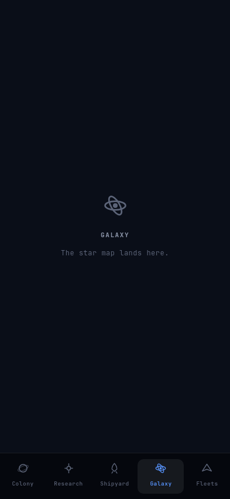

# Oltre

An asynchronous space colonisation strategy game in the OGame lineage. Short check-in sessions,
everything progresses while the app is closed: exponential cost curves, distance as travel time,
permanent fleet loss. v1 is local single-player against scripted AI empires; multiplayer is the
destination. iPhone is the delivery target, desktop is the dev loop.

All rights reserved. No license is granted for reuse of this code.

## Screens

<table>
<tr>
<td width="50%" align="center">

</td>
<td width="50%" align="center">

</td>
</tr>
<tr>
<td align="center"><b>Colony</b> — a fleet on its way home, what your plant supplies against what your facilities draw, and every facility with its level, cost, build time and countdown. Upgrades run in parallel.</td>
<td align="center"><b>Galaxy</b> — one of the three destinations that are not built yet. They say so, rather than being hidden until their screen exists.</td>
</tr>
</table>

One branch, three technologies, one project at a time — running, waiting on the deuterium,
and waiting on the lab:


Five destinations across the bottom, on a phone:


The three resources, accruing while you read them — above every tab, and amber when a power
shortage is holding the rates down:


A facility row per state — building with a countdown, affordable, not yet affordable
(the resource you're short in red, and when you'll have it), and locked:


Energy is not a resource — it never accumulates — so it is a ratio with a consequence attached
rather than a fourth cell in the rail. The empty tail is headroom you have not spent; the amber
tail is draw your plant cannot cover:


These are the committed Roborazzi baselines, not exported marketing shots — the same images CI
verifies the UI against on every push, so a screen here cannot drift from the screen that ships.
Recording them is the workflow in the `screenshot-testing` skill.

## Stack

Kotlin Multiplatform monorepo. Compose Multiplatform UI, no game engine.

| Module | What |
|---|---|
| `core` | KMP (jvm, iosArm64, iosSimulatorArm64, android). Pure model + rules; `kotlinx-serialization` is its only dependency, carrying the save format. |
| `sim` | JVM. Headless balancing harness, fast-forwards weeks in milliseconds. Never ships. |
| `client/*` | KMP + Compose Multiplatform: desktop, iOS, Android. Directory of modules — `:client:shell` (composition root, navigation and the resource rail), `:client:design` (theme), `:client:colony:presentation` and `:client:research:presentation` (the two screens that exist), `:client:save:data` (the JSON snapshot on disk), `:client:notifications:data` (the local alerts that are the check-in loop), one directory per feature as features land. |
| `server` | JVM + Ktor. Compiling stub until multiplayer starts. |
| `iosApp` | Xcode wrapper around the client framework (pending). |

Eight module rules are enforced by the build, and break an IDE sync rather than a review. A module
cannot contain another module. `domain` cannot depend on `data` or `presentation`, `presentation`
cannot depend on `data`, `data` cannot depend on `presentation`. A `-testing` module can be reached
only from a test source set, so fakes never ship. And the graph points inward with both ends
sealed: `core` depends on nothing, nothing depends on `:client:shell`, and `sim`/`server` never
reach into `client/*`. A module's layer is the last segment of its Gradle path, so `:client:shell`
— the composition root, the one module that may see every layer, precisely because nothing sees
it — is not one.

## Build

```bash
./gradlew build
```

## Test

```bash
./gradlew check
```

## Run

```bash
./gradlew :client:shell:run     # desktop client (dev loop)
./gradlew :sim:run        # balancing harness
./gradlew :server:run     # server stub
```

iOS: pending Xcode wrapper (`iosApp/`), arrives with the iOS wiring slice.

## Icon

The app icon is an SVG master; every platform asset is generated from it and committed.

```bash
python3 art/icon/generate.py
```

Edit `art/icon/*.svg`, rerun, commit the result — never hand-edit generated PNGs. See
[art/icon/README.md](art/icon/README.md).

## Docs

- [docs/ui-mockup.html](docs/ui-mockup.html) — UI design brief: Colony + Galaxy screens at iPhone size.
- [.claude/docs/brief.md](.claude/docs/brief.md) — distilled project brief; points to the Notion design page.
- [.claude/docs/balance-log.md](.claude/docs/balance-log.md) — every round of balance tuning: the numbers, the feedback that changed them, what is still open.
- `.claude/docs/` — architecture, decisions, status.

## Changelog

### 0.1.0 — 2026-08-08

- **The resource rail says the same thing in one line less.** Metal, Crystal and Deuterium each
  carry their own colour as a small orb beside the name, and the hourly rate moves up alongside the
  stock instead of sitting under it. The bar gives the 12dp back to whatever screen is below it. In
  a narrow window the rate drops under the stock rather than being cut off — which is the one thing
  the old three-line bar could never get wrong, and the new one had to be taught.
- **Six identical rectangles become a foreground and a background.** Every row catches a light
  along its top edge, and what a row can do now sets how bright it sits: one you can start comes
  forward, one waiting on stocks or on a prerequisite falls back, and the one in flight is the only
  lit thing on the screen. From four rows away that is the answer to "why can nothing else start".
- **The two Research branches read as two bands.** "TECHNOLOGIES · one project at a time" and
  "ADAPTATION · the same slot" now carry their clause out to the right edge with a hairline
  between, instead of two runs of grey text stacked above two lists.
- **There are stars behind the game.** A fixed starfield sits under every screen and under none of
  the chrome, so the black reads as space rather than as absence. It does not move, does not
  twinkle, and does not cost anything while the app is closed.

### 0.0.18 — 2026-08-08

- **You can buy an adaptation ladder, and watch a world open up.** The Research tab grows a second
  section — Thermal, Gravitic and Atmospheric, under the three production technologies — so the
  ladder every blocked world has been naming is finally on sale. Buy the one a world asks for, wait
  it out, and that world stops reading BLOCKED.
- **Tap the technology on a blocked world to go and buy it.** "Gravitic 3" on the Galaxy tab is a
  link now, and it lands on the section that sells it. It stopped looking tappable in 0.0.16 for
  one reason — nothing sold it — and that reason is gone.
- **One project at a time still means one, across both branches.** An adaptation ladder and a
  production technology compete for the same slot, so starting either stops the other five rows,
  and every one of them shows the same wait the running row is counting down. Climbing a ladder
  costs you the production level you did not research.
- **A ladder shows the band it widens.** "0.65 … 1.40 → 0.60 … 1.52 g" — what you tolerate now, and
  what the next level would make it, in the same units the Galaxy tab measures worlds in.
- **The Galaxy header stops apologising.** "Adaptation research lands later. You are at level 0."
  was true until this build and is gone from it.

### 0.0.17 — 2026-08-07

- **Nothing on screen changes in this build.** The three adaptation ladders every blocked world
  points at are now built and playable in the simulation, but no screen sells them yet — the
  Research tab still shows three technologies and the Galaxy tab still says you are at level 0.
  The screens are the next slice.
- **What landed underneath:** Thermal, Gravitic and Atmospheric Adaptation are real technologies.
  Each level widens the tolerance band on its own axis, so a world blocked on gravity stops being
  blocked at the level its row already names. All three open on a level 4 Robotics Factory, all
  three cost the same — priced in the resource their own axis makes rich — and all three compete
  for your single research slot, so climbing one costs the production technology you did not
  research instead.
- **Colonies carry forward.** Saves from 0.0.16 migrate: your research levels survive untouched and
  the three ladders start at zero.

### 0.0.16 — 2026-08-07

- **A blocked world now says what it is worth, not only what it costs.** The yield sits beside the
  verdict, so a world you cannot reach is one you can price: most of the ones in your home system
  are richer than home.
- **A screen full of BLOCKED reads as the galaxy rather than as bad luck.** Each row counts the
  bands it fails against the same bar a barren world names — "Fails 2 of 3 bands, worth it at
  0.92" — so the answer has a scale behind it. Nearly every surveyed world fails at least one band,
  and that is the design.
- **The Galaxy tab admits that the technology it names cannot be bought yet.** The adaptation
  ladders every blocked row points at are not built, so the header says so and the technology on
  the row no longer wears the colour the app uses for "go and tap this".

### 0.0.15 — 2026-08-07

- **The galaxy exists.** Four galaxies of 250 systems, fifteen orbits each — about 4,700 worlds, all
  of them generated from a single number saved with your colony. Nothing is stored but that number
  and what you have changed, so the map is the same every time you open the game and costs the save
  file nothing.
- **An easy world is a poor world.** Every world has a temperature, a gravity and an atmospheric
  pressure, and the same extremes that make one hostile are what make it rich: the coldest worlds
  hold the deuterium, the heaviest hold the metal, the thickest atmospheres hold the crystal. Each
  of the three blocks about three worlds in four, so which hostility you learn to survive first is
  a real choice rather than a ladder.
- **You can see the whole sky, and almost none of it in detail.** Coordinates, star class and who
  holds a world are free from the first launch. Everything else needs a survey, which needs fleets —
  so for now your home system is the only place you know anything about.
- **The Galaxy tab is real.** One system fills the screen: its fifteen orbits drawn once, left to
  right, hot to cold, with the worlds it holds listed underneath. The map shows the empty slots too,
  which is how you learn that the outer orbits are the cold ones without being told.
- **A world you cannot settle tells you what would change that.** "gravity 1.78, you tolerate
  1.40 g — Gravitic 4" is the whole sentence, one line per axis that fails. Your own home system is
  likely to hold two or three of them, richer than home every one: the good ground is behind
  technology nobody has bought yet. Those adaptation technologies are not built, so for now it is a
  shopping list you cannot spend against.
- **Roughly one world in three hundred is worth settling before you research anything** — about
  four in your home galaxy. Surveying is supposed to disappoint; a world that passes every test and
  is still too thin to bother with says so, and says what it would have needed.

### 0.0.14 — 2026-08-07

- **Nothing changed for the player.** This release is entirely internal: the pieces the Colony and
  Research screens share — the bolt that marks a throttled rate, the coloured cost figures, the
  progress bar under a job that is running, and the way the game writes durations and groups large
  numbers — were each written out two or three times, once per screen. They are now written once.
  Every screen draws exactly what it drew before, down to the pixel, and the screenshot tests are
  what proves it: not one of them changed.
- **Why it was worth doing anyway:** two copies of "what a price looks like" are two things that can
  drift apart, and when they do, the Colony and Research screens start quietly disagreeing about how
  the same number should read. That reads as the game being inconsistent rather than the code being
  duplicated.

### 0.0.13 — 2026-08-06

- **Research is playable.** The Research tab is real: one branch of three technologies —
  Photovoltaics raises what your Solar Plant makes, Extraction what both mines make, Enrichment
  what the synthesizer makes. Each one costs metal, crystal and deuterium, takes hours, and every
  level you finish shows up in the rates on the resource bar and in everything the colony produces
  while the app is closed. A finished project tells you, the same way a finished building does.
- **One project at a time.** Buildings still go up in parallel; research does not. The colony is
  limited by what you can pay for, research by what you can wait for — so every time the lab frees
  up, the question is which of the three, and it has a different answer on day four than on day
  eleven.
- **The branch is legible before you can use any of it.** All three technologies are listed from
  the first launch, dimmed, saying what they want: Photovoltaics and Extraction open with your
  first Robotics Factory, Enrichment once Extraction reaches level 3. A row you cannot start yet
  says *when* you will be able to, never just "no".
- **Every row shows what the next level actually buys** — "+36% → +47%" — because a level is only
  meaningful against the one before it.
- **Your stocks now follow you across the app.** The resource bar sits above every tab instead of
  only the Colony, so you can price a research project without switching back.
- **Colonies carry forward.** Existing saves keep their buildings, stocks, builds and fleets and
  simply start with nothing researched.
- **Your mines tell you when they are running at half power.** The colony has always throttled
  every mine when the solar plant could not keep up — a colony producing 50 energy against 90
  consumed was quietly losing 45% of its metal, crystal and deuterium — but nothing on screen
  said so, and it read as the game being slow rather than as a solar plant being needed. The
  colony screen now opens with a power card: a bar of what your plant supplies against what your
  facilities draw, and a plain reading of the consequence — "room for 1 mine level" while you
  have headroom, "every mine at 55%" once you do not. Each facility carries its own energy figure
  while a shortage lasts, the resource rail marks the rates it is holding down, and the Solar
  Plant says on its own card when one more level would end it.
- **Metal arrives at the rate the game spends it.** Metal was produced at twice the rate of
  crystal while the early build tree costs about three times as much metal as crystal, so metal
  was the bottleneck for every decision no matter how you played, and crystal piled up with
  nothing to spend it on. A mine now starts at 90 metal an hour instead of 60.

### 0.0.11 — 2026-08-06

- **The game has its five destinations.** A bottom bar carries Colony, Research, Shipyard, Galaxy
  and Fleets, and the game opens on the Colony as it always has. The four that are not built yet
  say so and say what will be there, rather than being hidden until their screen exists — so the
  shape of the game is visible from the first launch. The bar keeps its tabs on the same centred
  column as the content on an iPad or a wide desktop window, and fits five destinations in a
  Slide Over pane.

### 0.0.10 — 2026-08-06

- **The game tells you when to come back.** Every build you start and every fleet on its way
  home now books a notification at the exact moment it lands, so a colony left running while the
  app is closed reaches you instead of waiting to be checked on. The alerts are rebuilt from the
  colony itself whenever anything happens, so one that has been overtaken — a build that
  finished early, a colony reloaded from a save — is gone rather than stale, and starting three
  upgrades at once gets you three separate alerts. On iPhone permission is asked once, on the
  first launch; declining costs you the alerts and nothing else. On desktop the schedule is
  printed to the console rather than raised, because the dev loop already has the app open.
- **The version on TestFlight is the version in the repo.** 0.0.8 shipped labelled 0.0.7; the
  build number and the release label are both written from their real sources now, so a build
  cannot go out mislabelled again.

### 0.0.9 — 2026-08-06

- **The game is a real iPad app.** It no longer runs in the letterboxed iPhone compatibility
  window: it fills the screen in every orientation, resizes freely, and works in Split View,
  Slide Over and Stage Manager alongside another app.
- **The colony reads the same at any window size.** Past a phone's width the content stops
  stretching — it caps and centres, with the resource bar still spanning the top edge — so a
  facility row on a large iPad or a wide desktop window is as readable as on a phone. On a phone
  nothing changes.

### 0.0.8 — 2026-08-06

- **Upgrades run in parallel, and the numbers are human.** Every facility builds on its own —
  start a mine, a plant and a factory at once — and each row carries its own countdown, target
  level, finish time and progress bar instead of a single card at the top of the screen. The
  economy was rescaled to numbers you can hold in your head: a level-1 mine makes 60 metal an
  hour rather than 3,600, an upgrade raises output by a quarter instead of doubling it, and
  costs grow by half per level instead of doubling. A new colony now starts with enough metal
  and crystal to make its first choice immediately.
- **Colonies from 0.0.7 start over.** The rebalance is too deep to carry an old colony across —
  stocks earned at sixty times these rates would take weeks to earn now — so the save format
  moved to version 2 and version 1 saves are retired rather than converted: opening 0.0.8 on an
  older save begins a fresh colony. Saves written by 0.0.8 onwards load normally.

### 0.0.7 — 2026-08-06

- **Your colony survives closing the app, and keeps working while it is closed.** The game saves
  itself and reloads on launch: levels, stocks, the build in progress, a fleet still on its way
  home and the event log all come back, and every hour the app spent shut is credited on the way
  in — a build queued last night is finished by morning, and a fleet that landed overnight has
  already unloaded. The save is a JSON snapshot in the platform's app-data folder, rewritten only
  when something actually happens, and a save that has been corrupted or written by a newer build
  starts a fresh colony instead of crashing.

### 0.0.6 — 2026-08-06

- **Returning fleets are visible.** A fleet flying home sits in an amber strip under the hero
  card — where it's coming from, what it's made of, and a live countdown to arrival. When it
  lands, its cargo joins your stores (up to the storage cap) and the return is logged. Ship
  names are placeholders until the v1 ship set is decided.

### 0.0.5 — 2026-08-06

- **The Colony screen is playable.** The resource rail shows all three resources with live
  rates. Every facility lists its level, per-resource upgrade cost (deuterium included) and
  build duration — the exact resource you're short turns red, and instead of a dead button an
  unaffordable upgrade shows when you'll be able to afford it; the Nanite Factory stays locked
  until Robotics 10. Tapping Upgrade starts the build, and the one in-flight build sits in a
  hero card with a live countdown, progress bar and local finish time.

### 0.0.4 — 2026-08-06

- **Oltre has a face.** The app ships an icon — a planet's lit limb with a single trajectory
  rising past it into empty space — on iPhone, macOS, Windows and Linux. The artwork is an SVG
  master in `art/icon/`; every platform asset regenerates from it. Android's launcher assets are
  generated and staged, ready for the app module when it lands.

### 0.0.3 — 2026-08-05

- **The economy is real: six buildings, a build queue, and energy.** All three resources accrue
  from their mine levels; upgrades cost exponentially more per level, take time, and complete
  through the simulation as logged events; the Robotics Factory speeds construction and the
  Nanite Factory unlocks at Robotics 10; mines slow down proportionally when the Solar Plant
  can't feed them; storage caps at 10M per resource (placeholder). The sim harness
  fast-forwards a week of greedy play in milliseconds.

### 0.0.2 — 2026-08-05

- **The Colony resource rail is alive: metal accrues in real time while the app is open.**
  First vertical slice through every layer — the pure simulation core (guarded by the
  advance-composability property test), the Colony feature module rendering the rail, the
  desktop shell ticking the clock at the boundary, and the sim harness fast-forwarding a week
  in milliseconds. First screenshot baseline committed.

### 0.0.1 — 2026-08-05

- Initial project scaffold: KMP monorepo (core, sim, client, server), CI, branch ruleset.
