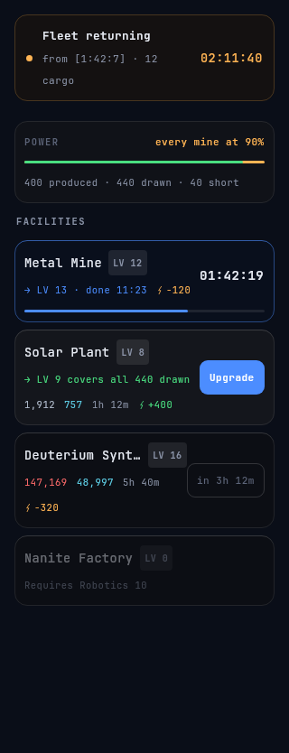
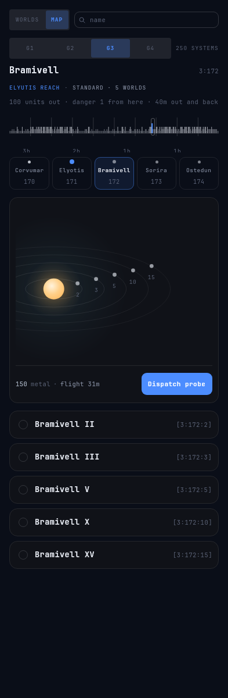
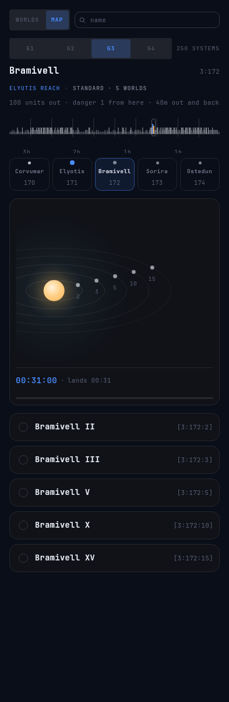
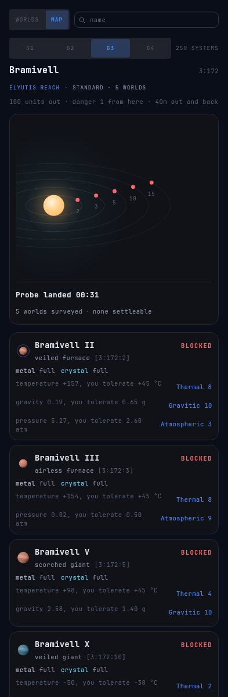
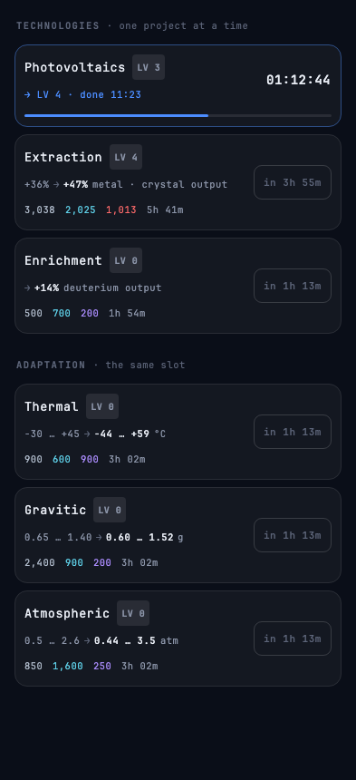
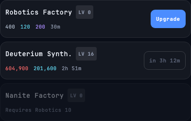
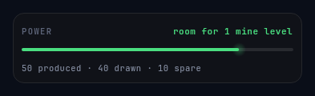
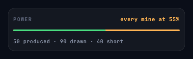

# Oltre

An asynchronous space colonisation strategy game in the OGame lineage. Short check-in sessions,
everything progresses while the app is closed: exponential cost curves, distance as travel time,
permanent fleet loss. v1 is local single-player against scripted AI empires; multiplayer is the
destination. iPhone is the delivery target, desktop is the dev loop.

All rights reserved. No license is granted for reuse of this code.

## Screens

<table>
<tr>
<td width="50%" align="center">

</td>
<td width="50%" align="center">

</td>
</tr>
<tr>
<td align="center"><b>Colony</b> — a fleet on its way home, what your plant supplies against what your facilities draw, and every facility with its level, cost, build time and countdown. Upgrades run in parallel.</td>
<td align="center"><b>Galaxy</b> — a system you have never been to: the reach band across the top, its fifteen orbits, and a probe you can send for 150 metal and half an hour of flight.</td>
</tr>
</table>

### Sending a probe

A dispatch costs 150 metal wherever it goes, so the only thing you are choosing is a **duration** —
which is why the band across the top is a ruler measured in hours rather than a list of coordinates.
All 250 systems of the galaxy at once, one tick each: short and faint for a dim star, tall and
bright for a bright one, blue for yours and amber for a probe already out there. The marks say how
long a flight to that part of the map would take, so the question the screen answers is *what can I
reach in the nine hours I am about to be asleep?*

The galaxy is not symmetric around you, and the ruler says so without a word of copy: from a home
near one edge, the hour marks simply run out on that side.

Drag the band to move; tap one of the seven cells to open a system. The cell beside the lit one is
what the ± stepper used to be — still one tap, except it now tells you what you are stepping onto
before you step. Crossing a galaxy used to be 249 taps.

Everything the probe says lands in the card that owns the star it is about: the price and the
flight, then a countdown, then what it found.





**"None settleable" is the honest answer about fifty-nine times in sixty**, and the screen says it in
the same breath as the count rather than burying it — a run of them should read as calibration, not
as bad luck. The notification you get while the app is closed says the same words off the same
count, so the lock screen and the card can never disagree about what your probe found.

One branch, three technologies, one project at a time — running, waiting on the deuterium,
and waiting on the lab:



Five destinations across the bottom, on a phone:


The three resources, accruing while you read them — above every tab, and amber when a power
shortage is holding the rates down:


A facility row per state — building with a countdown, affordable, not yet affordable
(the resource you're short in red, and when you'll have it), and locked:



Energy is not a resource — it never accumulates — so it is a ratio with a consequence attached
rather than a fourth cell in the rail. The empty tail is headroom you have not spent; the amber
tail is draw your plant cannot cover:





These are the committed Roborazzi baselines, not exported marketing shots — the same images CI
verifies the UI against on every push, so a screen here cannot drift from the screen that ships.
Recording them is the workflow in the `screenshot-testing` skill.

## Stack

Kotlin Multiplatform monorepo. Compose Multiplatform UI, no game engine.

| Module | What |
|---|---|
| `core` | KMP (jvm, iosArm64, iosSimulatorArm64, android). Pure model + rules; `kotlinx-serialization` is its only dependency, carrying the save format. |
| `sim` | JVM. Headless balancing harness, fast-forwards weeks in milliseconds. Never ships. |
| `client/*` | KMP + Compose Multiplatform: desktop, iOS, Android. Directory of modules — `:client:shell` (composition root, navigation and the resource rail), `:client:design` (theme), `:client:colony:presentation`, `:client:research:presentation` and `:client:galaxy:presentation` (the three screens that exist), `:client:save:data` (the JSON snapshot on disk), `:client:notifications:data` (the local alerts that are the check-in loop), `:client:debug:*` (the shake-to-open debug menu), `:client:tilt:*` (which way the device is being held, for the sky behind every screen), one directory per feature as features land. |
| `server` | JVM + Ktor. Compiling stub until multiplayer starts. |
| `iosApp` | Xcode wrapper around the client framework (pending). |

Eight module rules are enforced by the build, and break an IDE sync rather than a review. A module
cannot contain another module. `domain` cannot depend on `data` or `presentation`, `presentation`
cannot depend on `data`, `data` cannot depend on `presentation`. A `-testing` module can be reached
only from a test source set, so fakes never ship. And the graph points inward with both ends
sealed: `core` depends on nothing, nothing depends on `:client:shell`, and `sim`/`server` never
reach into `client/*`. A module's layer is the last segment of its Gradle path, so `:client:shell`
— the composition root, the one module that may see every layer, precisely because nothing sees
it — is not one.

## Build

```bash
./gradlew build
```

## Test

```bash
./gradlew check
```

## Run

```bash
./gradlew :client:shell:run          # desktop client (dev loop)
./gradlew :androidApp:installDebug   # Android, on a connected device or emulator
./gradlew :sim:run        # balancing harness
./gradlew :server:run     # server stub
```

iOS: open `iosApp/` in Xcode. The project is generated — edit `project.yml` and run `xcodegen
generate` rather than touching `project.pbxproj`.

## Install

Android builds are published as GitHub Releases. Take the latest APK from
[Releases](https://github.com/fardavide/oltre/releases) and open it on the phone; Android asks
once for permission to install from your browser. Updates install over the top.

iPhone builds go to TestFlight on every merge to `main`.

## Icon

The app icon is an SVG master; every platform asset is generated from it and committed.

```bash
python3 art/icon/generate.py
```

Edit `art/icon/*.svg`, rerun, commit the result — never hand-edit generated PNGs. See
[art/icon/README.md](art/icon/README.md).

## Docs

- [docs/ui-mockup.html](docs/ui-mockup.html) — UI design brief: Colony + Galaxy screens at iPhone size.
- [.claude/docs/brief.md](.claude/docs/brief.md) — distilled project brief; points to the Notion design page.
- [.claude/docs/balance-log.md](.claude/docs/balance-log.md) — every round of balance tuning: the numbers, the feedback that changed them, what is still open.
- `.claude/docs/` — architecture, decisions, status.

## Changelog

### 0.8.0 — 2026-08-12

- **You can buy ships.** The Shipyard tab is a price list: what the skiff is for, what the next one
  costs, and how many you own, how many are idle and how many are away. Every hull costs half again
  as much as the one before it, so the fleet has a ceiling you can see rather than one you find.
  Until now a colony had the one skiff it was given at genesis and no way to get a second.
- **The Fleets tab shows what is away.** One card per run, with a bar carrying all three phases —
  out, on station, and home again — and two marks where the flight ends and begins. Under it, what
  has landed and what it brought. The Colony strip has said `2 more away` since 0.7.0; this is what
  it was pointing at.
- **No tab says "nothing here yet" any more.** All five destinations have a screen behind them.
- **A fleet now brings home six times what one ship did, at the same rate per ship.** 0.7.2 tripled
  what a run pays; this release is what lets you have more than one ship carrying it. By the second
  day a four-a-day player is sending six skiffs instead of the single one the game used to grant —
  and the run itself still reads what 0.7.2 said it would.

### 0.7.2 — 2026-08-12

- **A gathering run brings home three times what it used to.** The first run a new colony can order
  went from 66 metal to 198, and the sheet states the new figure before you commit exactly as it
  did the old one.
- **Dangerous worlds now pay more instead of less.** Every point of danger used to take a tenth of
  the hold; it now adds a third to it. A world with two hazards on the far side of your galaxy is
  worth two and a half times a safe rock in your own system, where before it was worth half —
  so the reason to read the map is that the interesting places are the ones that pay.
- **The dispatch sheet says `+70% of the hold` where it used to say `20% of the hold`**, and reads
  `nothing added` on a completely safe run.

### 0.7.1 — 2026-08-12

- **The dispatch sheet is a real bottom sheet.** It shipped as a panel drawn inside the Galaxy tab,
  which meant it stopped above the row of tabs instead of covering them, it could not be dragged
  away, and a swipe over it scrolled the map behind it. It now behaves exactly like the sheet a
  facility or a technology opens: it covers the window, the handle drags, and a scroll on it is a
  scroll of it.

### 0.7.0 — 2026-08-12

- **You can send a ship somewhere.** Tap any world on the Galaxy tab and a sheet comes up that will
  fly your skiff there, sit on it, and bring back metal or crystal. Pick which of the two, how many
  hulls to send, and how long until you want them home — one hour, three, six, twelve or a day. The
  figure under the rule is what lands, and it moves as you touch the controls.
- **A world you cannot live on is still worth going to.** Hostility gates settling and never
  gathering, so the 98% of the galaxy that reads as blocked stops being a wall and starts being a
  shopping list. A blocked world now leads with what it is rich in rather than with what is wrong
  with it, and says how long the round trip takes.
- **The map says how far away you are, once.** Under the system header: how many units out, what the
  distance costs you in danger, and the round trip. Hazards stay on the worlds that carry them, with
  their own arithmetic — nothing prints the total except the sheet that spends it.
- **A run is free.** The hull was the price. There is no cost line on the sheet and nothing to be
  short of.
- **Send it too far and the short windows disappear** rather than greying out. A trip to the next
  galaxy is nine hours and twenty minutes out and back, so only the twelve- and twenty-four-hour
  windows are offered, and the sheet says why.
- **The Colony strip names the next thing that happens**, not the next thing that comes home — so a
  skiff still on its way out reads "On station at [3:185:4]".
- Your first skiff was granted at the founding of the colony and has had nothing to do since. It has
  something to do now.
### 0.6.0 — 2026-08-11

- **Every row now says what the level is worth to you.** A mine has always told you what it costs
  and how long it takes, and never whether it was worth taking. It does now, in one line, in the
  same shape on all thirteen rows: what the level hands you, and when you have your money back. A
  level-13 Metal Mine reads "+122/h metal · back in 102h" — four days to repay 12,458 metal is a
  fact worth having before you tap.
- **The three technologies are finally comparable.** 1h 42m against 33h against nothing is the
  choice the Research screen exists to present, and until now the screen showed you three
  percentages instead. Percentages are not something you can spend.
- **Two rows now admit they are worth nothing.** Photovoltaics multiplies energy supply, and while
  your colony has power to spare that multiplies nothing at all — so the row says so, rather than
  offering you a true number you cannot use. The Solar Plant beside it says the same thing in the
  same words.
- **The Robotics Factory and the Nanite Factory stopped being silent.** Neither raises a rate, so
  neither has ever had a line. Robotics now states what a level takes off your longest build and
  which gate it opens next; the Nanite Factory states what it is worth from day one, twelve days
  before you can build it, under the requirement that was previously the only thing it said.
- **A row that would slow your colony down says so before you buy it.** At genesis a second
  Deuterium Synthesizer level draws more power than your one plant makes, which throttles every
  mine you have — the row now reads "throttles every mine · Solar Plant 2 covers it" instead of
  looking like every other upgrade.
- **Tap a row to open it.** A new sheet carries the arithmetic behind the verdict, the numbers the
  verdict displaced — the rate pairs and the percentages — and, where a building gates something,
  the whole ladder of what opens at which level, including the levels you already hold. It never
  says do not buy this: the action stays live, because a player who wants it anyway is not wrong.
- Nothing about the balance moves. Same prices, same durations, same rates — a colony is worth
  exactly what it was worth yesterday, and saves carry forward untouched.

### 0.5.2 — 2026-08-11

- **The Nanite Factory does something.** It has been in the build tree since the first economy
  slice, priced at 20,000 metal and 10,000 crystal and 4,000 deuterium, gated behind Robotics
  Factory 10 — and until now nothing in the game read it. Buying it made your colony strictly
  poorer. It is now the only thing that shortens a deep build, and each level takes a third off
  the wait.
- **Deep upgrades are much slower, and only deep ones.** Past level 18 — which is roughly where
  your mines stand when the Nanite Factory unlocks — every further level costs progressively more
  waiting than the income that pays for it. A level 25 Metal Mine used to take a few hours and now
  takes the better part of a day unaided; a level 30 takes over a week.
- **Nothing before that moves at all.** The first fortnight is untouched to the minute: the first
  build still lands at two minutes, the research tab still opens around hour 6, the adaptation
  ladders still open at hour 9, and a colony still stands where it stood on day 1, 2, 3, 7 and 14.
  The long waits arrive with the Nanite Factory that answers them, and not before.
- **The Nanite Factory is an answer, not an exemption.** Six levels of it take a deep build from
  186 hours to 16 — an eleven-fold cut — and what is left is still hours. The late game is meant to
  be something you check in on while there is a fleet to move, not something you buy your way out
  of.
- Saves carry forward untouched: no stored value changes, and a colony keeps every level it has.

### 0.5.1 — 2026-08-11

- **Your neighbours are worth looking at now.** A new colony starts in a system that has somewhere
  to go: one of the worlds beside you is either already somewhere you could stand, or a single
  adaptation level away from it. It used to be the luck of the draw, and the draw was bad — the
  middling home system asked for seven levels across two different ladders before anything on the
  Galaxy screen would say something new, and four in five colonies were asked for four or more.
  Virtually every colony now opens a neighbour with its first purchase.
- **What that neighbour is worth has not changed, and that is deliberate.** It is usually a world
  that passes every band and is still not worth settling — the good ground is still further out,
  behind technology nobody has bought yet. What you are given is somewhere to point at, not
  somewhere good.
- **The three adaptation ladders open at Robotics Factory 2 instead of 4.** That is about half a
  day in rather than most of two days. Nothing else about them moves: same prices, same durations,
  same one research slot shared with the production technologies.
- **Existing colonies keep the home they were founded on.** Your map, your system and your
  neighbours are all exactly where you left them; the new rule only applies to a colony that has
  not started yet. Saves from 0.5.0 carry forward untouched.

### 0.5.0 — 2026-08-10

- **Every row now carries a bell, and every alert is one you asked for.** Tap the bell on a row you
  cannot afford and the game tells you the moment you can. Tap it on a row that is building and it
  tells you the moment that lands. Tap nothing and the game says nothing — completions no longer
  announce themselves.
- **The same bell, two questions, and the row decides which.** Any number of things in flight can be
  asked about at once, but only one "when can I afford it" in the whole empire: pointing that one at
  another row moves it, and both screens name what it is pointed at beside their heading, so a watch
  set on Research is never a thing that vanished quietly from the Colony tab.
- **Several finishing together arrive as one alert.** Anything you asked about that lands within five
  minutes of the one before it collapses into a single line — *"Three upgrades are done"* — instead
  of three buzzes for one check-in.
- **The instant stays true.** Spend the resources on something else and the alert slides later on the
  same tap that spent them; finish a Solar Plant that lifts a shortage and it slides earlier. While
  the app is closed nothing spends, so an alert can only ever fire early.
- **A narrower window loses no words.** In a Slide Over pane the bell drops under the time instead of
  beside it, the resource rail puts each rate under its stock, and the Robotics Factory goes by
  Robotics — which is what the game already calls it.
- Saves from 0.4.4 carry forward untouched. Anything already building when you update lands quietly,
  because nobody has tapped its bell yet.

### 0.4.4 — 2026-08-10

- **Tilting the phone sideways moves the sky the right way round.** It went the wrong way: drop the
  right edge and the stars slid left, away from the edge you dropped, which is the opposite of what
  your hand expects. They now go the way you tip it. Tipping forward and back was always right and
  is untouched.
- Nothing else about the effect changes — same distance for the same movement, same wrist, same
  everything. Only the direction of one of the two axes.
- Saves from 0.4.3 carry forward untouched.

### 0.4.3 — 2026-08-10

- **The sky answers a sideways lean as readily as a forward one.** Rolling the phone used to move
  the stars a fraction of what tipping it did — a quarter as far on a phone held at thirty degrees,
  half at forty-five — because the sideways reading was being weakened by the angle you happen to
  hold the phone at rather than by how far you turned it. The two directions now travel the same
  distance for the same movement, from every pose a hand rests in.
- **There is no longer an edge to the effect.** It used to stop about twenty degrees out, so
  anything more than a small wrist flick arrived in the same place and the sky went dead in your
  hand. Roll the phone now and it just keeps going, right round and round again. Tipping it forward
  and back tracks the whole way from flat on its back to flat on its face, then retraces as you
  carry on over — the sky can follow a roll for ever, but it can only follow a tip through the poses
  you can actually see the screen from.
- **A sideways roll no longer drags the sky diagonally.** It always did a little; once the limit came
  off, a big roll dragged it further up than the roll itself moved it sideways. Rolling now moves the
  sky sideways and nothing else.
- **Put the phone down and the sky stops.** 0.4.2 spent about ten seconds drifting back to level
  after you stopped moving, which was the price of the old limit; there is no limit and so no drift.
  Wherever you leave it is where it stays, however long you leave the game open — and putting it flat
  on a desk and spinning it leaves the sky alone, because from down there your phone genuinely cannot
  tell it is being turned.
- Still off entirely if you have asked your phone for less movement, and a phone with no motion
  sensor still holds still.
- Saves from 0.4.2 carry forward untouched.

### 0.4.2 — 2026-08-10

- **The sky behind every screen leans with the phone.** Tilt it and the three planes of stars slide
  against each other and against the cards in front of them, the near ones travelling further than
  the far ones — which is the whole of what makes a flat black background read as distance rather
  than as an empty window. It is a small movement on purpose: less than an eighth of what one screen
  of scrolling already moves the same field, and meant to be noticed on the third session rather
  than the first.
- **Nothing up there ever starts on its own.** The sky only moves when you move the phone; after
  you stop, a lean settles back to level over a few seconds and then holds, however long you leave
  the game open. Which also means every way of holding it works the same — flat on a desk, at an
  angle on a sofa, overhead in bed — rather than the sky sitting shoved to one side because of how
  you happen to be lying.
- **Off entirely if you have asked your phone for less movement.** The system's own reduce-motion
  setting switches it off on iOS and on Android, and a device with no motion sensor simply holds
  still.
- Saves from 0.4.1 carry forward untouched.

### 0.4.1 — 2026-08-10

- **Nothing you can see or do changes in this build.** The fleet that landed in 0.3.0 is still
  underneath the game rather than on a screen, and this is the round that measured what it is worth
  before any screen offers it.
- **A gathering run brings back half what it used to.** The rate was written from arithmetic and had
  never been simulated; simulating it showed that a player who bought ships before buildings would
  have had a fleet out-producing their own colony. Halving it means three or four ships match a mine
  rather than replacing it — the fleet is a second income, never the income.
- Saves from 0.4.0 carry forward untouched.

### 0.4.0 — 2026-08-10

- **The colony floats over a sky now.** Three planes of stars sit behind every screen and drift
  against each other as the list scrolls, so the black reads as distance rather than as an empty
  window. It is a hundred and one stars where there were twenty-six, and none of them move on
  their own — the field is a function of where the list is, exactly as the list is.
- **A running row wears a dial instead of a bar.** The hairline that used to run under a building
  facility or a research project is a 34dp ring beside the countdown, lit round to how far the job
  has got, with the level it is on now in the middle of it. It says the same thing in a tenth of the
  ink and takes the level with it.
- **The Galaxy screen is a system rather than a strip.** The fifteen ticks on a line are now orbits
  around a star with a corona, your colony carrying a halo of its own, and a probe in flight drawn as
  the arc it is flying. Each body still carries its slot number; the world list below is unchanged.
- **The app tells you what happened while you were away.** Stocks count up from the figure you last
  saw rather than simply being different, the dials and the energy meter fill into place once, and
  the one row that finished while the app was closed takes a band of light across it and changes its
  level behind the light. All of it plays exactly once per launch and then holds — a colony closed
  for two days still opens onto a screen with no clock ticking anywhere on it.
- **The resource rail is ruled.** A hairline between each pair of resources and one under the bar, so
  three figures side by side read as three columns rather than as one crowded line.
- **Every card takes the press.** A tap now shrinks its target by a hair under the ripple, which is
  the whole of what the app was missing to feel like it was being touched rather than read.

### 0.3.0 — 2026-08-10

- **Nothing on screen changes in this build.** Your colony can now send ships to a world it has
  surveyed and get cargo back, and the whole thing is playable in the simulation — but no screen
  offers it yet. The Galaxy tab still only lets you send a probe. The screens are the next slice.
- **What landed underneath:** you own a fleet, and a run is one commitment — a world you have already
  surveyed, whether the ships bring back metal or crystal, and how long until they are home. They fly
  out, work the surface for whatever is left of the window, and come back. What they bring is stated
  exactly before you commit and never rolled; nothing is hidden and every run comes home.
- **You can work a world you could never live on.** Hostility still decides where you can *settle*,
  and it no longer decides where you can *send a ship* — so the 98% of the map that reads BLOCKED
  stops being a wall. The richest worlds are the ones you cannot stand on, which is what makes this
  worth doing rather than a consolation prize.
- **Far is dangerous and hazardous is dangerous**, and a run says so before it leaves: a world's
  hazards and how far it sits from home each cost a tenth of the hold. Your own system, with nothing
  wrong with it, is a completely safe first trip.
- **Runs never cost deuterium and never bring it back**, so the Robotics Factory stays the thing you
  save for.
- **A new colony opens with one skiff**, the way it opens with 500 metal — the first session is a
  decision rather than a wait.
- **Colonies carry forward.** Saves from 0.2.7 migrate: your colony arrives with one skiff and
  nothing away.

### 0.2.7 — 2026-08-09

- **The first hour of a colony is a different game.** Upgrades in the opening cost a tenth of what
  they used to, and the first taps finish in two or three minutes rather than twenty. A player who
  sits with the app for ten minutes now watches seven things finish instead of nothing at all.
- **The discount and the clock both run out, and they run out where the galaxy opens.** By the ninth
  level of a mine the price is the price it always was and a build is back to half an hour, so
  nothing about the middle or the late game has moved — the whole change is spent on the opening,
  which is where it was needed.
- **The research and adaptation branches are on the same tenth**, so a technology never quietly
  becomes the expensive way to spend an opening the buildings are discounting.

### 0.2.6 — 2026-08-09

- **The debug menu's two verbs now take a hold rather than a tap**, and the button fills across as
  you hold it, with a buzz the moment it acts. The panel opens by shaking the phone — a gesture a
  pocket can perform — so neither skipping the colony forward nor deleting it should ever be one
  stray tap away. Reset no longer needs arming first; it just needs holding.
- **And the panel is a proper bottom sheet.** Drag it down to put it away, tap outside it, or use
  the back gesture — all the things a sheet is expected to do, because it is now the platform's own
  sheet rather than a panel drawn to look like one.
- **Resetting now clears the "debug used" mark instead of setting it.** The mark answers whether
  *this* colony's clock has been moved by hand, and a colony founded a moment ago has no history at
  all. Skipping is the only thing that sets it.

### 0.2.5 — 2026-08-09

- **A debug menu, for developing the game rather than playing it.** Shake the phone to open it
  (Ctrl+D or Cmd+D on desktop). It can skip the colony forward to the next thing that happens —
  a build finishing, the lab freeing up, a probe landing — and it can delete the colony and start
  a new one, which takes two taps because it cannot be undone. It also shows what the colony is
  doing underneath: the two clocks, the save's version, the galaxy's seed, what is in flight.
- It ships to everyone rather than to debug builds only, so that it works on TestFlight. Nothing
  opens it by accident, and skipping ahead is the only thing on it that changes the game.
- Saves now record whether the menu has ever touched the colony. Saves from 0.2.4 carry forward
  untouched and read as never debugged, which is what they are.

### 0.2.4 — 2026-08-09

- **The adaptation ladders join the opening discount.** They were the one thing left at full price,
  which made the first ladder cost nearly six times the technology beside it — a wall exactly where
  you first meet the galaxy. A first Thermal level is now 300/200/300 instead of 900/600/900, and the
  ladders settle back to full price alongside the rest.
- **Nothing in the game can quietly overflow any more.** Every cost, duration and stock is a 64-bit
  integer, and a 64-bit integer that runs out does not fail — it comes back negative, and a negative
  price is one the game reads as *free*. Every curve now refuses to produce one.
- **A colony you leave for years no longer breaks on the way back.** Returning after a very long
  absence — or with a device clock that has jumped — used to compute a number too large to hold
  before it capped it at your storage. It now caps the time instead, so a full store is a full store
  whether you were gone a week or a century.

### 0.2.3 — 2026-08-09

- **The whole opening is on a discount.** Everything you can buy in the first days costs exactly a
  third of its full price at level one — a first Metal Mine level is 20 metal instead of 60, the
  first Extraction is 200/133/66 instead of 600/400/200 — and the discount shrinks with every level
  until it is gone. Deep upgrades cost exactly what they always did; only the opening moved.
- **It runs out when the galaxy opens.** Full price arrives at facility level 9 and technology level
  4, which is the same session the adaptation ladders unlock and your probes' findings become
  something you can act on rather than only read.
- **Research is cheaper *and* quicker early**, not just cheaper: the first Photovoltaics takes 20
  minutes instead of an hour.
- **You get about a day further in the same four days**, and roughly twice as much research done —
  day four now finishes nine projects where it used to manage four.
- **The Research tab opens on day one** instead of day two, and the adaptation ladders on day three
  instead of day five. No requirement changed: the Robotics Factory is simply cheaper at the start
  like everything else.
- Resource production is untouched. Mines produce exactly what they produced yesterday.

### 0.2.2 — 2026-08-09

- **Upgrades stopped outgrowing your income.** A build used to take as long as it *cost*, and
  because costs climb faster than mines do, the wait ran away from you: a sixth Metal Mine level
  took 3h 07m to build against 1h 50m to earn, and a sixth Deuterium Synthesizer took twelve and a
  half hours. A build now takes about as long as *earning* it does — 1h 32m and 3h 08m for those
  two — and it stays that way at every depth instead of only near the start.
- **You no longer have to have guessed that the Robotics Factory is the clock.** It still halves
  your builds, but skipping it used to cost a player two building levels over the first two days and
  a six-and-three-quarter-hour wait for a single tap; now it costs neither, and the worst wait in
  those two days is 2h 20m.
- Same progress after two days as before, and rather more after a week.
### 0.2.1 — 2026-08-09

- **Oltre runs on Android.** The whole game, on any phone running Android 8.0 or newer — the same
  colony, research and galaxy the desktop and iPhone builds have, with the save kept in the app's
  own storage and carried across a reinstall by Android's backup.
- **Every version is downloadable.** Merging to `main` now publishes a GitHub Release with the APK
  attached, the way it already ships the iPhone build to TestFlight. The release page carries this
  changelog and the commit it was built from; the download is a direct link that installs from a
  phone browser with nothing else needed.
- **The game tells you when to come back on Android too.** The same alerts iPhone has — a build
  finished, the lab is free, a fleet has landed — booked in advance at the instants the
  simulation already computed, and re-derived from your colony after a reboot. Android may hold
  one back by a few minutes while the phone is dozing; nothing else about them differs.
- Saves from 0.2.0 carry forward untouched.

### 0.2.0 — 2026-08-09

- **You can send a probe now.** The system page has a footer under the orbit map: what it costs
  (150 metal, the same everywhere) and how long the flight takes to *this* star, which is the only
  figure that changes. Tap Dispatch and it becomes a countdown, then a landing that tells you what
  the probe found — usually that none of it was worth taking, which is the honest answer about
  fifty-nine times in sixty.
- **The ± buttons are gone, and good riddance.** Crossing a galaxy used to be 249 taps. In their
  place is a band showing all 250 systems at once, marked with how long a flight to each one would
  take — 1h, 2h, 3h — so you can answer the only question a dispatch really asks: *what can I reach
  in the nine hours I am about to be asleep?* Each tick is a star, drawn short and faint for a dim
  one and tall and bright for a bright one; yours is the blue one, and a probe in flight is amber.
  Drag the band to move around, then tap one of the seven cells to open a system.
- **The galaxy is not symmetric around you, and now the band says so** without a word of copy: if
  your home sits near one edge, the hour marks simply run out on that side.
- **Every build now takes as long as it costs**, instead of a flat time per level. Early upgrades
  are longer — a first mine level is 37 minutes rather than 20 — and the colony stops standing
  around: over the first two days it now has something in flight 31% of the time instead of 12%.
  Same progress by day two, and about three levels fewer by day seven.
- **Each adaptation ladder says what its next level would unlock** among the worlds you have
  actually surveyed, and how few of them are worth taking.
- **A probe that lands while you are away sends a notification** — and the game will no longer let a
  crowd of probes push your long builds off the end of the notification queue.
- Saves from 0.1.2 carry forward untouched.

### 0.1.2 — 2026-08-09

- **Nothing on screen changes in this build.** The galaxy can now be explored — you send a probe
  to a star system, it flies for hours, and when it lands every world around that star stops
  reading "Unsurveyed" — but no screen offers the dispatch yet. The Galaxy tab still shows the
  four worlds of your home system and nothing else. The screen is the next slice.
- **What landed underneath:** a fourth thing you can do, and the first one aimed at a place rather
  than at a row in a list. A probe costs 150 metal flat however far it goes; only the flight time
  changes with distance, from half an hour to the system next door up to a night's worth across
  the galaxy. So the question it asks is "how long will I be away" — and a player about to be gone
  nine hours has a better answer than one who is not.
- **Probes never expire and never punish you for being away.** A landed report waits as long as you
  need it to, nothing decays, and a system you already know cannot be paid for twice.
- **Research will tell you what exploring was for:** each adaptation ladder can now say how many of
  the worlds you have found its next level would unlock, so the choice between Thermal, Gravitic
  and Atmospheric stops being arbitrary once you have seen more than your own back garden.
- Saves from 0.1.1 carry forward untouched, including every world you had already surveyed.

### 0.1.1 — 2026-08-08

- **Crystal accrues half again as fast: 30/h becomes 36/h at level 1, and every level above it
  rises in step.** Crystal was the only thing anyone was ever waiting for. A week of play spent
  130 of its 168 hours with an upgrade that was affordable in every currency except crystal, and
  ended holding 49,544 metal with nothing to spend it on. The mines were tuned against the cost of
  the whole early tree, which counts the Robotics Factory and the Deuterium Synthesizer — the two
  most metal-heavy things in the game, and the two you buy a handful of times rather than every
  session. They are now tuned against the basket you actually repeat: a level of Metal Mine,
  Crystal Mine and Solar Plant.
- **The Crystal Mine stops being the worst buy on the screen.** Priced against the Metal Mine it
  paid back 1.6× slower at every level, so the answer to a crystal shortage was the least
  rewarding upgrade available. It is now 1.3× — still the patient one, no longer a penalty.

### 0.1.0 — 2026-08-08

- **The resource rail says the same thing in one line less.** Metal, Crystal and Deuterium each
  carry their own colour as a small orb beside the name, and the hourly rate moves up alongside the
  stock instead of sitting under it. The bar gives the 12dp back to whatever screen is below it. In
  a narrow window the rate drops under the stock rather than being cut off — which is the one thing
  the old three-line bar could never get wrong, and the new one had to be taught.
- **Six identical rectangles become a foreground and a background.** Every row catches a light
  along its top edge, and what a row can do now sets how bright it sits: one you can start comes
  forward, one waiting on stocks or on a prerequisite falls back, and the one in flight is the only
  lit thing on the screen. From four rows away that is the answer to "why can nothing else start".
- **The two Research branches read as two bands.** "TECHNOLOGIES · one project at a time" and
  "ADAPTATION · the same slot" now carry their clause out to the right edge with a hairline
  between, instead of two runs of grey text stacked above two lists.
- **There are stars behind the game.** A fixed starfield sits under every screen and under none of
  the chrome, so the black reads as space rather than as absence. It does not move, does not
  twinkle, and does not cost anything while the app is closed.

### 0.0.18 — 2026-08-08

- **You can buy an adaptation ladder, and watch a world open up.** The Research tab grows a second
  section — Thermal, Gravitic and Atmospheric, under the three production technologies — so the
  ladder every blocked world has been naming is finally on sale. Buy the one a world asks for, wait
  it out, and that world stops reading BLOCKED.
- **Tap the technology on a blocked world to go and buy it.** "Gravitic 3" on the Galaxy tab is a
  link now, and it lands on the section that sells it. It stopped looking tappable in 0.0.16 for
  one reason — nothing sold it — and that reason is gone.
- **One project at a time still means one, across both branches.** An adaptation ladder and a
  production technology compete for the same slot, so starting either stops the other five rows,
  and every one of them shows the same wait the running row is counting down. Climbing a ladder
  costs you the production level you did not research.
- **A ladder shows the band it widens.** "0.65 … 1.40 → 0.60 … 1.52 g" — what you tolerate now, and
  what the next level would make it, in the same units the Galaxy tab measures worlds in.
- **The Galaxy header stops apologising.** "Adaptation research lands later. You are at level 0."
  was true until this build and is gone from it.

### 0.0.17 — 2026-08-07

- **Nothing on screen changes in this build.** The three adaptation ladders every blocked world
  points at are now built and playable in the simulation, but no screen sells them yet — the
  Research tab still shows three technologies and the Galaxy tab still says you are at level 0.
  The screens are the next slice.
- **What landed underneath:** Thermal, Gravitic and Atmospheric Adaptation are real technologies.
  Each level widens the tolerance band on its own axis, so a world blocked on gravity stops being
  blocked at the level its row already names. All three open on a level 4 Robotics Factory, all
  three cost the same — priced in the resource their own axis makes rich — and all three compete
  for your single research slot, so climbing one costs the production technology you did not
  research instead.
- **Colonies carry forward.** Saves from 0.0.16 migrate: your research levels survive untouched and
  the three ladders start at zero.

### 0.0.16 — 2026-08-07

- **A blocked world now says what it is worth, not only what it costs.** The yield sits beside the
  verdict, so a world you cannot reach is one you can price: most of the ones in your home system
  are richer than home.
- **A screen full of BLOCKED reads as the galaxy rather than as bad luck.** Each row counts the
  bands it fails against the same bar a barren world names — "Fails 2 of 3 bands, worth it at
  0.92" — so the answer has a scale behind it. Nearly every surveyed world fails at least one band,
  and that is the design.
- **The Galaxy tab admits that the technology it names cannot be bought yet.** The adaptation
  ladders every blocked row points at are not built, so the header says so and the technology on
  the row no longer wears the colour the app uses for "go and tap this".

### 0.0.15 — 2026-08-07

- **The galaxy exists.** Four galaxies of 250 systems, fifteen orbits each — about 4,700 worlds, all
  of them generated from a single number saved with your colony. Nothing is stored but that number
  and what you have changed, so the map is the same every time you open the game and costs the save
  file nothing.
- **An easy world is a poor world.** Every world has a temperature, a gravity and an atmospheric
  pressure, and the same extremes that make one hostile are what make it rich: the coldest worlds
  hold the deuterium, the heaviest hold the metal, the thickest atmospheres hold the crystal. Each
  of the three blocks about three worlds in four, so which hostility you learn to survive first is
  a real choice rather than a ladder.
- **You can see the whole sky, and almost none of it in detail.** Coordinates, star class and who
  holds a world are free from the first launch. Everything else needs a survey, which needs fleets —
  so for now your home system is the only place you know anything about.
- **The Galaxy tab is real.** One system fills the screen: its fifteen orbits drawn once, left to
  right, hot to cold, with the worlds it holds listed underneath. The map shows the empty slots too,
  which is how you learn that the outer orbits are the cold ones without being told.
- **A world you cannot settle tells you what would change that.** "gravity 1.78, you tolerate
  1.40 g — Gravitic 4" is the whole sentence, one line per axis that fails. Your own home system is
  likely to hold two or three of them, richer than home every one: the good ground is behind
  technology nobody has bought yet. Those adaptation technologies are not built, so for now it is a
  shopping list you cannot spend against.
- **Roughly one world in three hundred is worth settling before you research anything** — about
  four in your home galaxy. Surveying is supposed to disappoint; a world that passes every test and
  is still too thin to bother with says so, and says what it would have needed.

### 0.0.14 — 2026-08-07

- **Nothing changed for the player.** This release is entirely internal: the pieces the Colony and
  Research screens share — the bolt that marks a throttled rate, the coloured cost figures, the
  progress bar under a job that is running, and the way the game writes durations and groups large
  numbers — were each written out two or three times, once per screen. They are now written once.
  Every screen draws exactly what it drew before, down to the pixel, and the screenshot tests are
  what proves it: not one of them changed.
- **Why it was worth doing anyway:** two copies of "what a price looks like" are two things that can
  drift apart, and when they do, the Colony and Research screens start quietly disagreeing about how
  the same number should read. That reads as the game being inconsistent rather than the code being
  duplicated.

### 0.0.13 — 2026-08-06

- **Research is playable.** The Research tab is real: one branch of three technologies —
  Photovoltaics raises what your Solar Plant makes, Extraction what both mines make, Enrichment
  what the synthesizer makes. Each one costs metal, crystal and deuterium, takes hours, and every
  level you finish shows up in the rates on the resource bar and in everything the colony produces
  while the app is closed. A finished project tells you, the same way a finished building does.
- **One project at a time.** Buildings still go up in parallel; research does not. The colony is
  limited by what you can pay for, research by what you can wait for — so every time the lab frees
  up, the question is which of the three, and it has a different answer on day four than on day
  eleven.
- **The branch is legible before you can use any of it.** All three technologies are listed from
  the first launch, dimmed, saying what they want: Photovoltaics and Extraction open with your
  first Robotics Factory, Enrichment once Extraction reaches level 3. A row you cannot start yet
  says *when* you will be able to, never just "no".
- **Every row shows what the next level actually buys** — "+36% → +47%" — because a level is only
  meaningful against the one before it.
- **Your stocks now follow you across the app.** The resource bar sits above every tab instead of
  only the Colony, so you can price a research project without switching back.
- **Colonies carry forward.** Existing saves keep their buildings, stocks, builds and fleets and
  simply start with nothing researched.
- **Your mines tell you when they are running at half power.** The colony has always throttled
  every mine when the solar plant could not keep up — a colony producing 50 energy against 90
  consumed was quietly losing 45% of its metal, crystal and deuterium — but nothing on screen
  said so, and it read as the game being slow rather than as a solar plant being needed. The
  colony screen now opens with a power card: a bar of what your plant supplies against what your
  facilities draw, and a plain reading of the consequence — "room for 1 mine level" while you
  have headroom, "every mine at 55%" once you do not. Each facility carries its own energy figure
  while a shortage lasts, the resource rail marks the rates it is holding down, and the Solar
  Plant says on its own card when one more level would end it.
- **Metal arrives at the rate the game spends it.** Metal was produced at twice the rate of
  crystal while the early build tree costs about three times as much metal as crystal, so metal
  was the bottleneck for every decision no matter how you played, and crystal piled up with
  nothing to spend it on. A mine now starts at 90 metal an hour instead of 60.

### 0.0.11 — 2026-08-06

- **The game has its five destinations.** A bottom bar carries Colony, Research, Shipyard, Galaxy
  and Fleets, and the game opens on the Colony as it always has. The four that are not built yet
  say so and say what will be there, rather than being hidden until their screen exists — so the
  shape of the game is visible from the first launch. The bar keeps its tabs on the same centred
  column as the content on an iPad or a wide desktop window, and fits five destinations in a
  Slide Over pane.

### 0.0.10 — 2026-08-06

- **The game tells you when to come back.** Every build you start and every fleet on its way
  home now books a notification at the exact moment it lands, so a colony left running while the
  app is closed reaches you instead of waiting to be checked on. The alerts are rebuilt from the
  colony itself whenever anything happens, so one that has been overtaken — a build that
  finished early, a colony reloaded from a save — is gone rather than stale, and starting three
  upgrades at once gets you three separate alerts. On iPhone permission is asked once, on the
  first launch; declining costs you the alerts and nothing else. On desktop the schedule is
  printed to the console rather than raised, because the dev loop already has the app open.
- **The version on TestFlight is the version in the repo.** 0.0.8 shipped labelled 0.0.7; the
  build number and the release label are both written from their real sources now, so a build
  cannot go out mislabelled again.

### 0.0.9 — 2026-08-06

- **The game is a real iPad app.** It no longer runs in the letterboxed iPhone compatibility
  window: it fills the screen in every orientation, resizes freely, and works in Split View,
  Slide Over and Stage Manager alongside another app.
- **The colony reads the same at any window size.** Past a phone's width the content stops
  stretching — it caps and centres, with the resource bar still spanning the top edge — so a
  facility row on a large iPad or a wide desktop window is as readable as on a phone. On a phone
  nothing changes.

### 0.0.8 — 2026-08-06

- **Upgrades run in parallel, and the numbers are human.** Every facility builds on its own —
  start a mine, a plant and a factory at once — and each row carries its own countdown, target
  level, finish time and progress bar instead of a single card at the top of the screen. The
  economy was rescaled to numbers you can hold in your head: a level-1 mine makes 60 metal an
  hour rather than 3,600, an upgrade raises output by a quarter instead of doubling it, and
  costs grow by half per level instead of doubling. A new colony now starts with enough metal
  and crystal to make its first choice immediately.
- **Colonies from 0.0.7 start over.** The rebalance is too deep to carry an old colony across —
  stocks earned at sixty times these rates would take weeks to earn now — so the save format
  moved to version 2 and version 1 saves are retired rather than converted: opening 0.0.8 on an
  older save begins a fresh colony. Saves written by 0.0.8 onwards load normally.

### 0.0.7 — 2026-08-06

- **Your colony survives closing the app, and keeps working while it is closed.** The game saves
  itself and reloads on launch: levels, stocks, the build in progress, a fleet still on its way
  home and the event log all come back, and every hour the app spent shut is credited on the way
  in — a build queued last night is finished by morning, and a fleet that landed overnight has
  already unloaded. The save is a JSON snapshot in the platform's app-data folder, rewritten only
  when something actually happens, and a save that has been corrupted or written by a newer build
  starts a fresh colony instead of crashing.

### 0.0.6 — 2026-08-06

- **Returning fleets are visible.** A fleet flying home sits in an amber strip under the hero
  card — where it's coming from, what it's made of, and a live countdown to arrival. When it
  lands, its cargo joins your stores (up to the storage cap) and the return is logged. Ship
  names are placeholders until the v1 ship set is decided.

### 0.0.5 — 2026-08-06

- **The Colony screen is playable.** The resource rail shows all three resources with live
  rates. Every facility lists its level, per-resource upgrade cost (deuterium included) and
  build duration — the exact resource you're short turns red, and instead of a dead button an
  unaffordable upgrade shows when you'll be able to afford it; the Nanite Factory stays locked
  until Robotics 10. Tapping Upgrade starts the build, and the one in-flight build sits in a
  hero card with a live countdown, progress bar and local finish time.

### 0.0.4 — 2026-08-06

- **Oltre has a face.** The app ships an icon — a planet's lit limb with a single trajectory
  rising past it into empty space — on iPhone, macOS, Windows and Linux. The artwork is an SVG
  master in `art/icon/`; every platform asset regenerates from it. Android's launcher assets are
  generated and staged, ready for the app module when it lands.

### 0.0.3 — 2026-08-05

- **The economy is real: six buildings, a build queue, and energy.** All three resources accrue
  from their mine levels; upgrades cost exponentially more per level, take time, and complete
  through the simulation as logged events; the Robotics Factory speeds construction and the
  Nanite Factory unlocks at Robotics 10; mines slow down proportionally when the Solar Plant
  can't feed them; storage caps at 10M per resource (placeholder). The sim harness
  fast-forwards a week of greedy play in milliseconds.

### 0.0.2 — 2026-08-05

- **The Colony resource rail is alive: metal accrues in real time while the app is open.**
  First vertical slice through every layer — the pure simulation core (guarded by the
  advance-composability property test), the Colony feature module rendering the rail, the
  desktop shell ticking the clock at the boundary, and the sim harness fast-forwarding a week
  in milliseconds. First screenshot baseline committed.

### 0.0.1 — 2026-08-05

- Initial project scaffold: KMP monorepo (core, sim, client, server), CI, branch ruleset.
